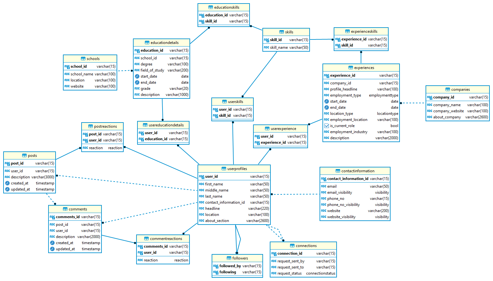

# LinkedIn Database Design

LinkedIn stands out as a professional networking platform with a user base of over 750 million professionals worldwide. 
It handles an enormous amount of user data, including profiles, connections, job postings, and much more. In this blog post, 
I'll design a database for LinkedIn and understand the various entities and relationships between them.

To keep the scope of this blog limited, here are the requirements that we want our database to satisfy:

1. Users can create their profile with information like name, contact information, headline, summary, education, work experience and different skills.
2. Users can send connection requests to other users, or follow them only. They should also be able to accept or reject the connection request.
3. Users can create posts, and like and comment on others' 

> Read the entire blog post here: 

### Complete Database Design

