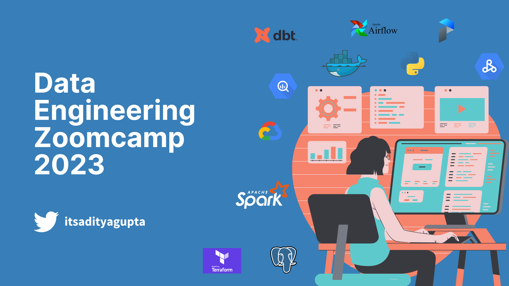
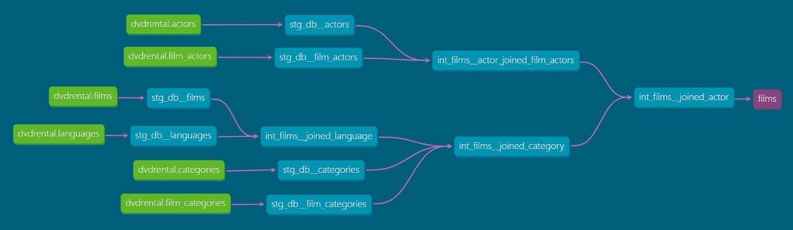
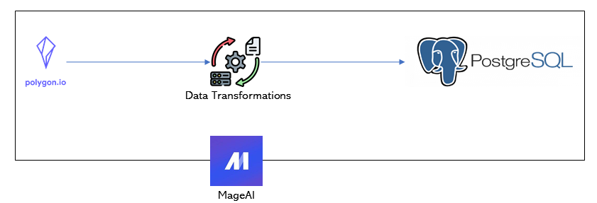

# Data Engineering Project Portfolio

> Welcome to my data engineering projects repository! Here you will find a collection of data engineering projects 
> that I have worked on. Please find below a brief overview of the projects.

### YelpoSphere: Discover the Complete Picture of the Restaurant Industry

Do you want to know the latest trends in the restaurant industry, but don't have the time or 
expertise to sort through Yelp data? This project takes care of the heavy lifting for you.

Using an **end-to-end data pipeline** built on **GCP** with **terraform**; using services like 
**Cloud Composer, Dataproc, Google Cloud Storage, and DBT**, YelpoSphere provide curated 
insights into the hottest new spots in town, the most popular dishes, and the trends shaping 
the industry. 

With this project, you'll have everything you need to stay ahead of the curve and make informed decisions about where to 
eat next.

| **Date**           	| **Domain**       	| **Project URL**                                                         	| **Skills**                                                                       	|
|--------------------	|------------------	|-------------------------------------------------------------------------	|----------------------------------------------------------------------------------	|
| Feb 2023 - April 2023 	| Data Engineering 	| [yelposphere](https://github.com/Aditya-Gupta1/yelp-gcp-infrastructure) 	| GCP, Apache Spark, Airflow, SQL, Python, GCS, Dataproc, Cloud Composer, BigQuery 	|

### LinkedIn Database Design

Designed an OLTP database for LinkedIn considering some basic features regarding user profiles, connections, posts and comments. Read the entire blog here: https://itsadityagupta.hashnode.dev/linkedin-database-design

| **Date** 	| **Domain**     	| **Project URL**                                                                                                         	| **Skills**     	|
|----------	|----------------	|--------------------------------------------------------------------------------------------------------------------	|----------------	|
| Feb 2023 	| Data Modelling 	| [linkedin-db-design-oltp](https://github.com/Aditya-Gupta1/data-engineering-projects/tree/linkedin-db-design-oltp) 	| Data Modelling 	|

### Data Engineering ZoomCamp 2023

The Data Engineering Zoomcamp 2023 course is designed to provide a comprehensive understanding of data engineering techniques and practices. The course includes various 
assignments and projects that cover a wide range of topics such as data pipeline development (ETL/ELT), data warehousing, workflow orchestration and many such things.

| **Date** 	                | **Domain** 	       | **Project URL**      	| **Skills**    |
|---------------------------|--------------------|-----------------	| ----------------- |
| Jan 2023 - Present      	 | Data Engineering 	 |  [de-zoomcamp-2023](https://github.com/Aditya-Gupta1/data-engineering-projects/tree/de-zoomcamp-2023)	| Python, Docker, Terraform, Prefect, DBT, BigQuery, Postgres, GCS |

### DVD Rental Data Transformation Pipeline using [DBT (Data Build Tool)](https://www.getdbt.com/)

This DBT project utilizes the DVD rental database and implements various transformations to clean and structure the data. A dashboard is then created to display the insights 
and analysis derived from the transformed data. The project demonstrates the use of DBT to perform data modeling and manipulation tasks, as well as the ability to create a 
user-friendly interface for data visualization.

| **Date**           	 | **Domain**            	| **Project URL**                                                                             	| **Skills** 	                        |
|----------------|-----------------------	|----------------------------------------------------------------------------------------	|-------------------------------------|
| Jan 2023 	     | Analytics Engineering 	| [dvdrental](https://github.com/Aditya-Gupta1/data-engineering-projects/tree/dvdrental) 	| DBT, Metabase, Docker, SQL        	 |

### Telecom Customer Data Transformation Pipeline using DBT

This is a basic DBT transformation pipeline built for the sole purpose of exploring and understanding DBT. It contains basic features of DBT.
For a more advance use of DBT, refer to the [DVD Rental Data Transformation Pipeline.](#dvd-rental-data-transformation-pipeline-using-dbt-data-build-toolhttpswwwgetdbtcom)

| **Date** 	| **Domain**            	| **Project URL**                                                                         	| **Skills** 	|
|----------	|-----------------------	|------------------------------------------------------------------------------------	|------------	|
| Dec 2022 	| Analytics Engineering 	| [telecom](https://github.com/Aditya-Gupta1/data-engineering-projects/tree/telecom) 	| DBT, SQL   	|

### Polygon ETL Pipeline using [MageAI](https://www.mage.ai/)

This project is an exploration of using MageAI to build an ETL pipeline. The pipeline is designed to extract data from Polygon API, transform it to fit 
the desired format, and load it into a Postgres database. The pipeline is implemented using MageAI, a powerful tool for building and deploying data pipelines 
quickly and easily. This project demonstrates the capabilities of MageAI in terms of data extraction, transformation, and loading, and serves as a guide for 
those interested in using MageAI for their own data pipeline projects.

| **Date** 	| **Domain**   	| **Project URL**                                                                                       	| **Skills**     	|
|----------	|--------------	|--------------------------------------------------------------------------------------------------	|----------------	|
| Dec 2022 	| ETL Pipeline 	| [mageai-polygon](https://github.com/Aditya-Gupta1/data-engineering-projects/tree/mageai-polygon) 	| MageAI, Python 	|

### MapReduce Examples

| **Date** 	| **Domain** 	| **Project URL**                                                                                             	 | **Skills**        	|
|----------	|------------	|---------------------------------------------------------------------------------------------------------------|-------------------	|
| Dec 2022 	| Big Data   	| [mapreduceexamples](https://github.com/Aditya-Gupta1/data-engineering-projects/tree/mapreduceexamples) 	      | MapReduce, Python 	|

This repository contains a collection of map-reduce code written in Python. The code is developed as a part of an Udemy course on big data processing using Hadoop and 
Map-Reduce. The course provides an introduction to the concepts of big data and distributed computing, and covers the fundamentals of Hadoop and Map-Reduce programming.
