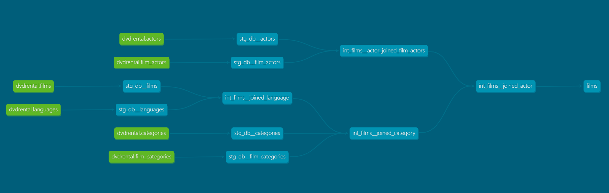
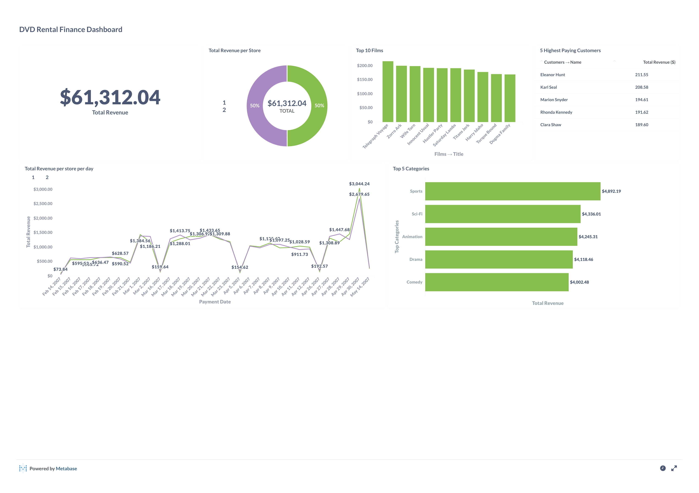

# DVD Rental Data Transformation Pipeline

This DBT project utilizes the DVD rental database and implements various transformations to clean and structure 
the data. A dashboard is then created to display the insights and analysis derived from the transformed data. 
The project demonstrates the use of DBT to perform data modeling and manipulation tasks, as well as the ability 
to create a user-friendly interface for data visualization.



### Run the project

#### Prerequisites

- [Docker](https://www.docker.com/)
- [Docker Compose](https://docs.docker.com/compose/)

#### Steps to run

```commandline
git clone https://github.com/Aditya-Gupta1/data-engineering-projects.git
git checkout dvdrental
docker-compose up
```

Open [http://localhost:8080](http://localhost:8080) to view dbt docs and data lineage. 

> Note that the credentials to all the docker services are passed through [.env](https://github.com/Aditya-Gupta1/data-engineering-projects/blob/dvdrental/.env)
> file. Ideally, this file should not be pushed to version control, but it is done for easy reproducibility
> of the project.

To execute custom dbt commands:

- Run `docker ps` and get the container id for `dbt-workload` container.
- Open a bash shell in the container running dbt project using the command `docker exec -it <container-id> bash`.

This will open a bash terminal in the dbt container. Here, you can execute any dbt commands that you want.

> Make sure to append `--profiles-dir profiles` to all the dbt commands that you run to provide
> a valid path for `profiles.yml` file.

### About the project

The [`docker-compose.yml`](https://github.com/Aditya-Gupta1/data-engineering-projects/blob/dvdrental/docker-compose.yml)
file contains 4 services:

1. `db`: This is a postgres database which populates itself with the data through [restore.sql](https://github.com/Aditya-Gupta1/data-engineering-projects/blob/dvdrental/data/dvdrental/restore.sql) script.
2. `dbt-workload`: This uses [`Dockerfile`](https://github.com/Aditya-Gupta1/data-engineering-projects/blob/dvdrental/Dockerfile) to build an image and run dbt commands in the container.
3. `pdadmin`: This runs pgadmin on [http://localhost:5050](http://localhost:5050). You can view database and run queries using pgAdmin.
4. `dashboard`: This runs a metabase server at [http://localhost:3001](http://localhost:3001). You can use this to build dashboards and reports.

Here is an example of the dashboard I built using metabase:



The project creates 4 marts after transformations: **films, finance, marketing and stores.** Each of the marts
have their own separate schema in the database.

### DBT Concepts used

- sources
- models
- macros
- tests
- docs
- tags
- materialization
- profiles
- assets
- dbt-utils